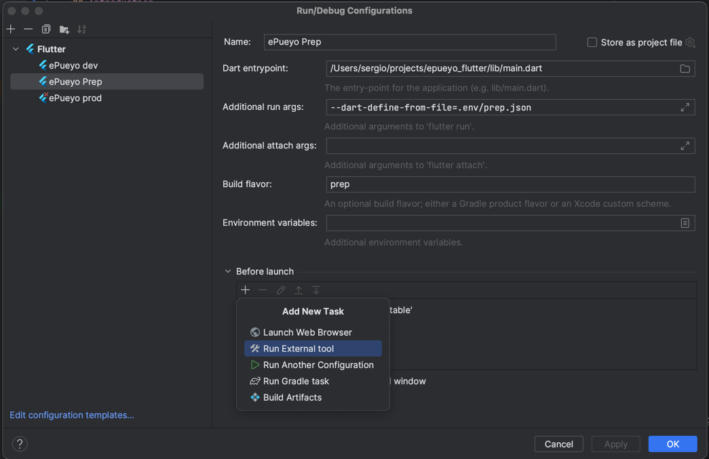
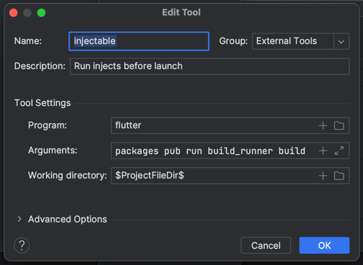

# Flutter architecture template

## Introduction

This project is a starting point for a Flutter applications created by Worldline Spain.

## Environment

The application has three environments and each one has its own configuration file:

- dev: `.env/dev.dart`
- prep: `.env/prep.dart`
- prod: `.env/prod.dart`

## Configure new project

To configure a new project, you have change the following files:

1. The environment files with the key and values.
2. Replace the project name `worldline_flutter` in all files.
3. Replace the package name `com.worldline.flutter` in all files.
4. Remove all files with references to Example code.

## Run and build

To run the application in each environment, you can use the following commands:

- dev: `flutter run --flavor dev --dart-define-from-file=.env/dev.json`
- prep: `flutter run --flavor prep --dart-define-from-file=.env/prep.json`
- prod: `flutter run --flavor prod --dart-define-from-file=.env/prod.json`

Also, you can configure your IDE to run the application in each environment:

["Android Studio environment config"](media/config.png)

## Dependency injection

The dependency injection is done using [get_it](https://pub.dev/packages/get_it) and [injectable](https://pub.dev/packages/injectable). If you add a new dependency, you have to run the following command to generate the necessary code:

```bash
flutter packages pub run build_runner build
```

Also, you can configure Android Studio to run this command automatically:

1. On the configuration, add a new "External tool" execution step in the "before launch" section

   

2. Configure the execution step as follows:

   

Is important to note that you have to configure the command for the three flavors.
